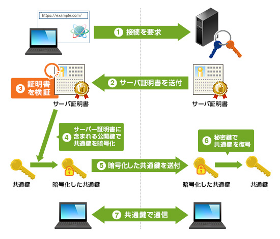

% SSL/TLSの基礎
% yamotonalds
% 2016-03-23

# SSL/TLSとは

## 安全な通信プロトコル

Transport Layer Security

- 認証
- 暗号化
- 改ざん検知

## 使用用途

SSL/TLSはアプリケーション層より下のレイヤー

⇒ いろいろなアプリケーション層のプロトコルと組み合わせ可能

- **https**
- SMTPs
- FTPs

## 推奨の流れ

- [Google SEO](http://googlewebmastercentral-ja.blogspot.jp/2015/12/indexing-https-pages-by-default.html)
    - 評価が同じならhttpsを優遇
- [Apple ATS](https://developer.apple.com/library/prerelease/ios/releasenotes/General/WhatsNewIniOS/Articles/iOS9.html#//apple_ref/doc/uid/TP40016198-SW14)
    - httpsを強制
    - 例外ドメイン指定もできるけどAppleとしてはhttpsを推奨
- HTTP/2
    - [主要ブラウザがTLS無しに対応していない](https://ja.wikipedia.org/wiki/HTTP/2#.E3.82.A6.E3.82.A7.E3.83.96.E3.83.96.E3.83.A9.E3.82.A6.E3.82.B6)

# 仕組み

## 処理の流れ

※画像はGeoTrustから引用
https://www.geotrust.co.jp/ssl_guideline/ssl_beginners/?sid=ssl

## 証明書の種類

- ドメイン認証
    - ドメインの所有者である
    - 最近は無料で発行してもらえる([Let's Encrypt](https://letsencrypt.org/))
- 企業実在認証
    - ドメイン所有者かつ組織が法的に存在する
- EV SSL
    - ドメイン所有者かつ組織が法的・物理的に存在する
    - 世界標準の認証ガイドライン
    - アドレスバーがめっちゃ緑になるやつ
    - 12〜15万円/年

## バージョン

- SSL 1.0
- SSL 2.0
- SSL 3.0
- TLS 1.0　　　　　　
- TLS 1.1
- TLS 1.2
    - ATSの要求
- TLS 1.3
    - 現在提案中

## 認証・鍵共有方式

- RSA暗号
    - 今までの主流
- 楕円曲線暗号
    - ECDSA,ECDH等
    - RSAより高速

## cipher suite

「認証方式・暗号化方式・改ざん検知ハッシュ関数」の組み合わせ

例: `ECDHE-RSA-AES256-GCM-SHA384`

ATSではこれも指定されている

# 脆弱性

## Heartbleed

## Heartbleed

2014年4月に発覚したOpenSSLのバグによる脆弱性

日本でも[三菱UFJニコスが被害](http://itpro.nikkeibp.co.jp/article/NEWS/20140421/551884/)にあった

v1.0.1gで修正

## POODLE

## POODLE

🐩

2014年10月に報告されたSSL 3.0の脆弱性

TLS onlyへ

## その他の脆弱性

- 2013年
    - BREACH
- 2015年3月
    - FREAK
- 2015年5月
    - Logjam
- 2016年3月
    - DROWN
    - CacheBleed

# 安全に使用するために

##

- OpenSSLは最新版を
    - LibreSSLは知らない
- デフォルト設定せずに推奨されてる設定を
    - [Mozilla SSL Configuration Generator](https://mozilla.github.io/server-side-tls/ssl-config-generator/)

ご安全に！
